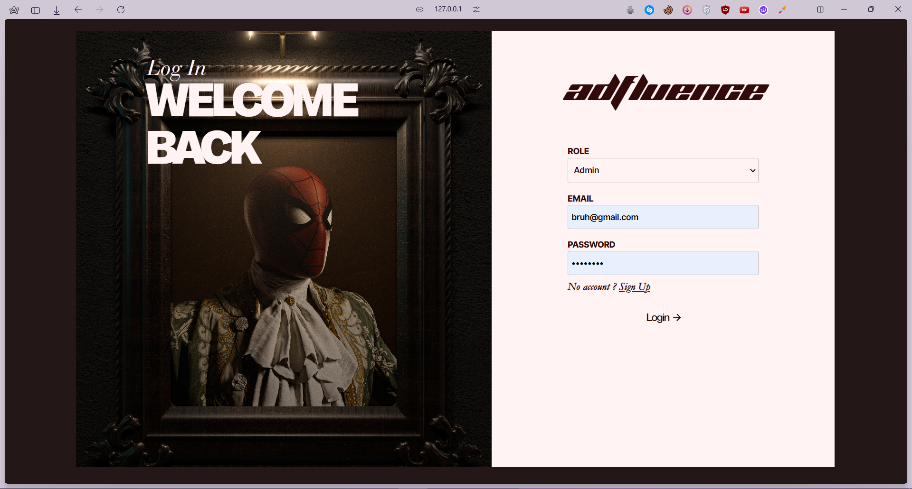
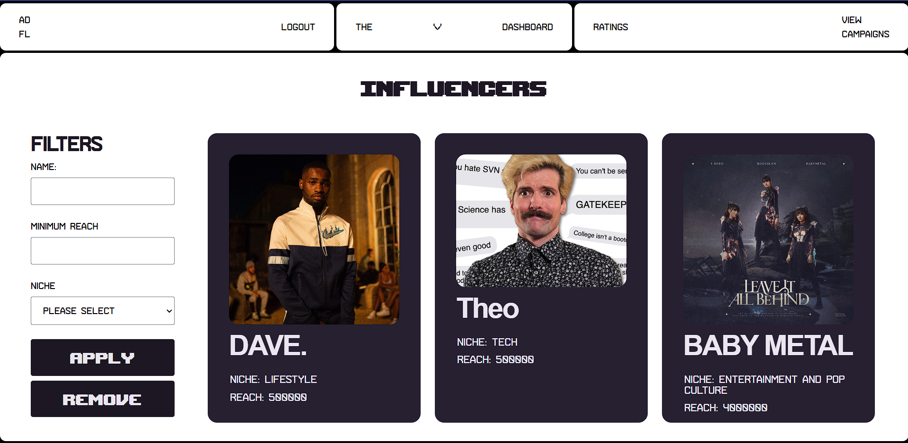
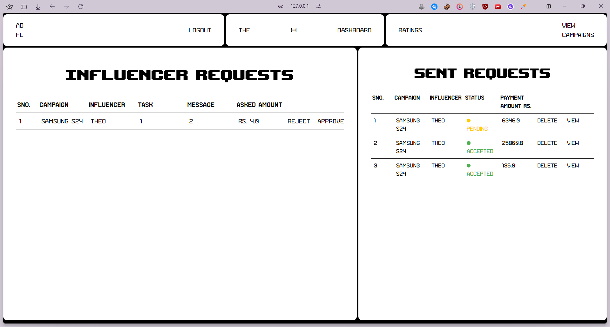
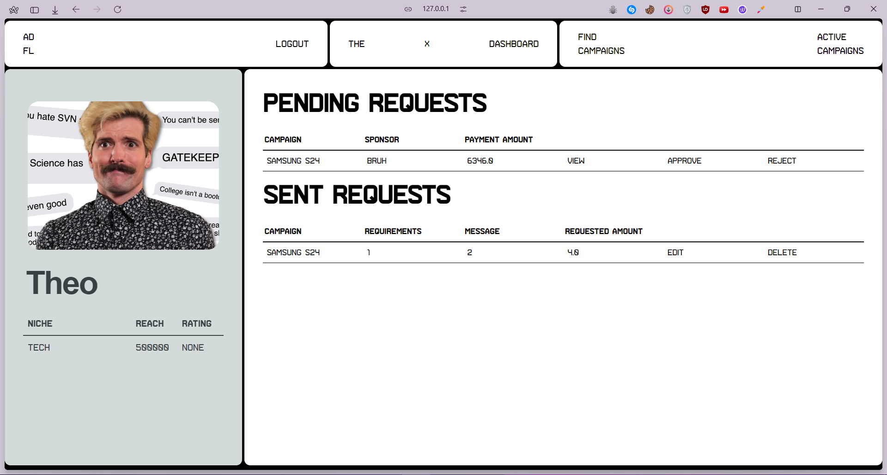
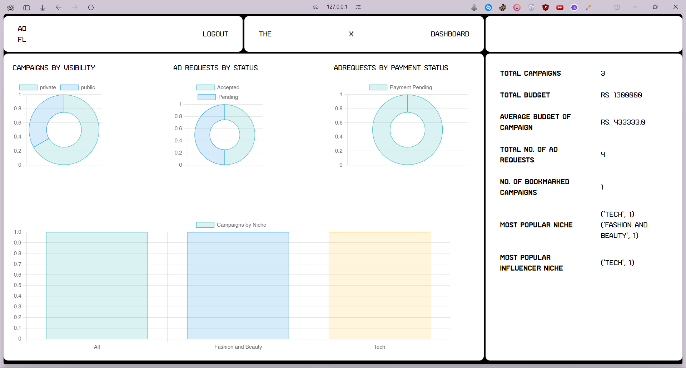

# AdfluenceFlow

As part of my Modern Application Development course at IIT Madras, I developed an Influencer Engagement and Sponsorship Coordination Platform using flask that bridges sponsors and influencers, facilitating seamless collaborations for mutual benefit.

The problem statement was to make a software which connect Sponsors and Influencers so that sponsors can get their product/service advertised and influencers can get monetary benefit.

Implemented features include creating and managing campaigns, two-way request handling and negotiation, dummy payment processing, and PDF+CSV transaction reporting. Utilized role-based access control for user authentication and authorization.

Additionally, I created RESTful APIs for each model in the database.

🗝️ Key Features:

- Sponsors can easily find the right influencers for their products/services
- Influencers can monetize their reach and creativity
- Seamless campaign management and tracking
- User authentication and personalized profiles
- Booking system for influencer-sponsor collaborations
- Rating and feedback mechanism
- Comprehensive admin dashboard with analytics
- Interactive charts for data visualization (using ChartJS)

## Screenshots







## Tech Stack

### Frontend

- Tailwind CSS
- Jinja2
- Vanilla JavaScript
- ChartJS.

### Backend

- Flask
- Flask-login
- Flask_RESTful
- SQLite
- SQL Alchemy (ORM).

## Installation

#### Clone the Repository

```
git clone https://github.com/k4p1l/MAD-1-Project-IESCP.git
```

#### Change the working directory

```
cd Adfluence
```

####

#### Create a New virtual environment

```
python -m venv .venv
```

#### Activate the virtual environment

```
venv\Scripts\activate.bat
```

#### Install all the depedenices

```
- pip install -r requirements.txt
- npm install
```

#### Run the app

```
python main.py
```


